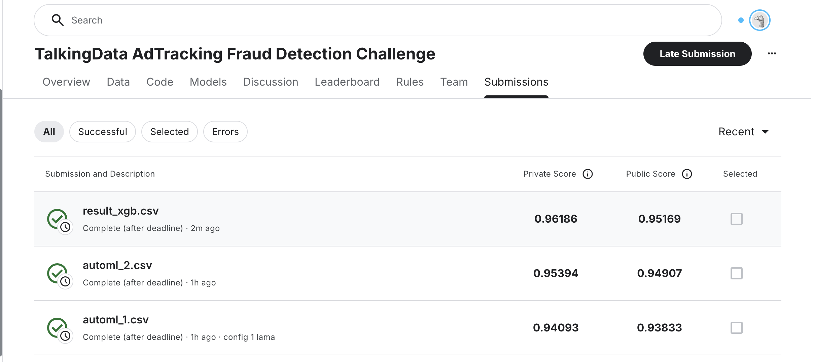

# lama-adtracking

# [TalkingData AdTracking Fraud Detection Challenge](https://www.kaggle.com/competitions/talkingdata-adtracking-fraud-detection/overview)

## Описание задачи

### Суть проблемы
TalkingData — крупная мобильная платформа с более чем 700 миллионами уникальных устройств ежемесячно. Компания борется с **мошенничеством при клике на рекламу** (click fraud).

**Проблема:** Не все клики ведут к установке приложения. Некоторые клики — это **боты и мошенники**, которые искусственно генерируют трафик для увеличения CTR (Click-Through Rate) без реального интереса пользователя.

**Цель:** Построить модель машинного обучения, которая предсказывает вероятность того, что клик на рекламу приведет к установке приложения (is_attributed = 1).

---

## Описание данных

### Структура датасета
```
Train: 184,528,143 строки (18.45M после сэмплирования)
Target: is_attributed (бинарная переменная: 0 или 1)
```

### Признаки
| Признак | Тип | Описание |
|---------|-----|---------|
| **ip** | категориальный | IP адрес устройства |
| **app** | категориальный | ID приложения, на которое кликнули |
| **device** | категориальный | Тип устройства (телефон, планшет и т.д.) |
| **os** | категориальный | Операционная система устройства |
| **channel** | категориальный | ID канала рекламы |
| **click_time** | временной | Время клика в UTC |
| **is_attributed** | целевая | 1 если произошла установка, 0 если нет |

### Целевая переменная (is_attributed)
```
Класс 0 (нет установки): 99.77% всех кликов
Класс 1 (есть установка): 0.23% всех кликов
```

**Вывод:** Данные **сильно несбалансированы**. Наивный классификатор, который всегда предсказывает 0, будет правильным в 99.77% случаев, но совершенно бесполезен.

---

## Выбор метрики: ROC AUC

#### Accuracy неподходящая:
```
Accuracy = (TP + TN) / (TP + TN + FP + FN)

Если модель всегда предсказывает 0:
Accuracy = 99.77% 

Но модель не полезна!
```

#### ROC AUC подходит идеально:

**ROC AUC (Area Under the Receiver Operating Characteristic Curve)** — метрика, которая:
   - Неуязвима к дисбалансу классов
   - Позволила избежать ловушки наивного классификатора

1. **Не зависит от дисбаланса классов**
   - Работает хорошо даже когда один класс редкий (0.23%)
   - Фокусируется на качестве ранжирования, а не на абсолютных значениях

2. **Учитывает trade-off между TPR и FPR**
   ```
   TPR (True Positive Rate) = TP / (TP + FN)  — доля найденных мошенников
   FPR (False Positive Rate) = FP / (FP + TN) — доля ложных алармов
   ```

3. **Интерпретируемость**
   - ROC AUC = 0.5 → модель угадывает (как монета)
   - ROC AUC = 1.0 → идеальная модель
   - ROC AUC > 0.95 → отличная модель

**Рещультаты в нашем проекте:**
- XGBoost: ROC AUC = **0.9619** (приватный) / 0.9517 (публичный)
- LAMA Config 2: ROC AUC = **0.9539** (приватный) / 0.9491 (публичный)
- LAMA Config 1: ROC AUC = **0.9409** (приватный) / 0.9383 (публичный)

---

## Методология решения

### 1. Разделение данных (Train-Test Split)

**Стратегия: Временное разделение 80/20**

Данные содержат временную координату (click_time), поэтому используется **хронологическое разделение**:
- **Train (80%):** клики с 2017-11-07 по 2017-11-08 (~14.5M строк)
- **Validation (20%):** клики с 2017-11-09 по 2017-11-10 (~3.6M строк)

**Почему важно:**
- Предотвращает **data leakage** (утечку данных из будущего в прошлое)
- Реалистично моделирует production сценарий

### 2. Анализ признаков (EDA)

#### 2.1. Распределение целевой переменной
```
is_attributed = 0:  99.77% (негативный класс)
is_attributed = 1:   0.23% (позитивный класс)
```

#### 2.2. Анализ категориальных признаков
- **IP адреса:** 364,778 уникальных значений
  - Боты часто используют одни и те же IP
  - Сильно коррелирует с fraud
  
- **App ID:** 707 уникальных приложений
  - Некоторые приложения привлекают больше мошенников
  
- **Device/OS:** Некоторые типы устройств более подвержены fraud

#### 2.3. Анализ временных паттернов
- Паттерны кликов меняются во времени
- Разные часы дня имеют разные уровни fraud

### 3. Feature Engineering

**Логика:** Боты часто генерируют много кликов с одного IP за короткое время -- подробнее в ноутбуке

### 4. Моделирование

#### 4.1. LAMA Baseline (LightAutoML)

**Config 1: Быстрое обучение**
```python
{
    'timeout': 500 сек,
    'use_algos': [['lgb', 'catboost']],
    'max_tuning_iter': 20
}
```
**Результат:** ROC AUC = 0.9409 (приватный)

**Config 2: Тщательное обучение**
```python
{
    'timeout': 1200 сек,
    'use_algos': [['lgb', 'catboost', 'linear_l2']],
    'max_tuning_iter': 50,
    'fit_on_holdout': True
}
```
**Результат:** ROC AUC = 0.9539 (приватный) ← **лучше**

**Преимущества LAMA:**
- Автоматический выбор моделей
- Автоматическая обработка категориальных признаков
- Встроенный feature engineering
- Минимальная настройка гиперпараметров

#### 4.2. XGBoost + Optuna (Альтернативное решение)

**Гиперпараметровая оптимизация:**
```python
N_TRIALS = 100  # количество испытаний
TIMEOUT = 600   # секунд

Параметры:
- max_depth: 3-10 (глубина дерева)
- learning_rate: 0.001-0.3 (скорость обучения)
- n_estimators: 100-1000 (количество деревьев)
- subsample: 0.5-1.0 (доля строк для обучения)
- colsample_bytree: 0.5-1.0 (доля признаков)
- reg_alpha, reg_lambda: L1/L2 регуляризация
```

**Оптимальные параметры (Trial 1):**
```python
{
    'max_depth': 8,
    'learning_rate': 0.01198,
    'n_estimators': 850,
    'subsample': 0.7695,
    'colsample_bytree': 0.6180,
    'reg_alpha': 0.0181,
    'reg_lambda': 0.0154,
    'min_child_weight': 4
}
```

**Результат:** ROC AUC = 0.9619 (приватный) ← **лучший результат**


**GPU ускорение:**
```python
'tree_method': 'gpu_hist'  # Обучение на видеокарте
'gpu_id': 0                # ID видеокарты
```
- CPU обучение: ~200 сек/trial
- GPU обучение: ~20 сек/trial (10x ускорение)

---

## Результаты

### Итоговое сравнение моделей

| Модель | Приватный Score | Публичный Score | Метрика |
|--------|-----------------|-----------------|---------|
| **XGBoost + Optuna** | 0.96186 | 0.95169 | ROC AUC |
| LAMA Config 2 | 0.95394 | 0.94907 | ROC AUC |
| LAMA Config 1 | 0.94093 | 0.93833 | ROC AUC |

### Анализ результатов

#### 1. XGBoost превосходит LAMA на 0.0080 (0.96186 vs 0.95394)
- **Причина:** Явная оптимизация гиперпараметров с Optuna
- **Улучшение:** +0.84% от базового решения

#### 2. Gap между приватным и публичным score
- Приватный: 0.9619
- Публичный: 0.9517
- Gap: 0.0102 (1%)
- **Вывод:** Модель хорошо обобщается на новые данные
- 
## Требуемые библиотеки

```bash
pip install numpy pandas torch seaborn matplotlib scikit-learn scipy lightautoml xgboost optuna --break-system-packages
```

### Версии
- **lightautoml**: 0.4.2
- **xgboost**: >= 1.5
- **optuna**: >= 3.0
- **scikit-learn**: >= 1.0

---

## Заключение

Данный проект демонстрирует:

1. **Правильный выбор метрики** (ROC AUC вместо Accuracy) для несбалансированных задач
2. **Важность стратегии разделения данных** (временное разделение для временных рядов)
3. **Эффективность явной гиперпараметровой оптимизации** (Optuna)
4. **Использование GPU** для ускорения обучения

**Финальный результат:** ROC AUC = 0.9619, что показывает отличное качество модели в предсказании fraud кликов.

